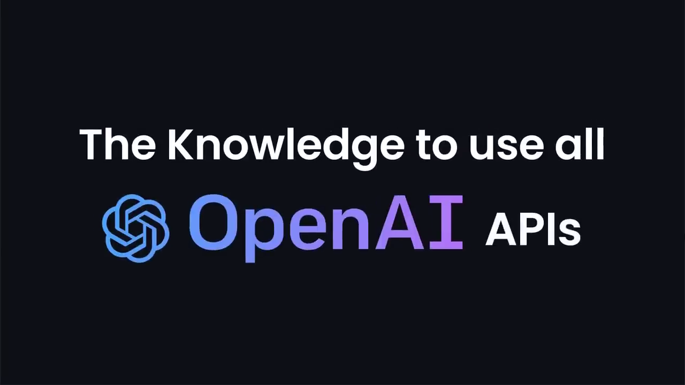
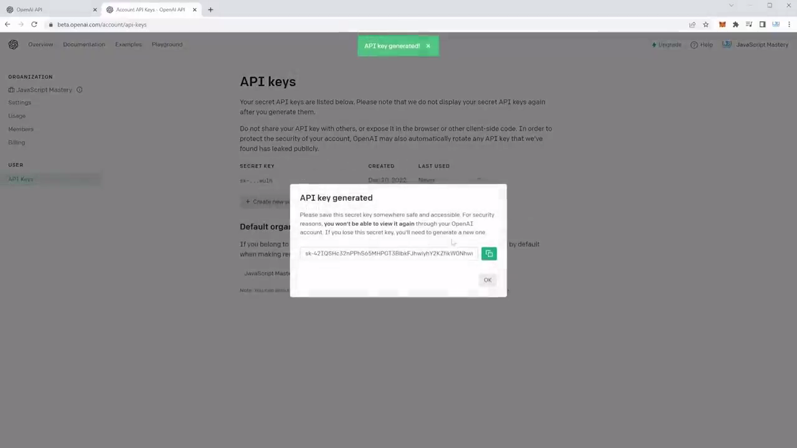
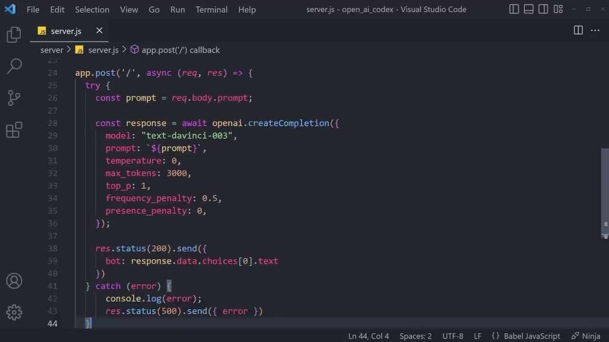

# ChatGPT Server

> ChatGPT Backend Project.

<!-- > Live demo [_here_](https://www.example.com). -->

## Table of Contents

- [General Info](#general-information)
- [Technologies Used](#technologies-used)
- [Features](#features)
- [Screenshots](#screenshots)
- [Setup](#setup)
- [Usage](#usage)
- [Project Status](#project-status)
- [Room for Improvement](#room-for-improvement)
- [Acknowledgements](#acknowledgements)
- [Contact](#contact)

## General Information

- Ability to ask the AI for help
- Giving it code & translating it to another language
- The knowledge to use all OpenAI API
- To make sense how OpenAI API works

## Technologies Used

- Tech 1 - OpenAI
- Tech 2 - Node.js
- Tech 3 - Express

## Features

List the ready features here:

- Use Node.js for the server side
- Interacts with ChatGPT Client project
- For better understand all the great functionalities

## Screenshots

## Setup

This project uses Node.js for backend.
Install Node.js.
Run `npm install` to install node_modules.
`npm run server` to run server.

## Usage

You can use this to combine with ChatGPT Client project.
Get API_KEY from OpenAI site and put the key in .env file.\
Support chatbot AI API.

## Project Status

Project is: _complete_.

## Room for Improvement

These are room for improvement and ToDos.

Room for improvement:

- OpenAI API
- Node.js

To do:

- Use this for various chatbot backend

## Acknowledgements

- This project was inspired by Valentyn.
- This project was based on [this tutorial](https://platform.openai.com/docs/).
- Many thanks to Valentyn.

## Contact

Created by [@violetstar701](https://) - feel free to contact me!

<!-- Optional -->
<!-- ## License -->
<!-- This project is open source and available under the [... License](). -->

<!-- You don't have to include all sections - just the one's relevant to your project -->
